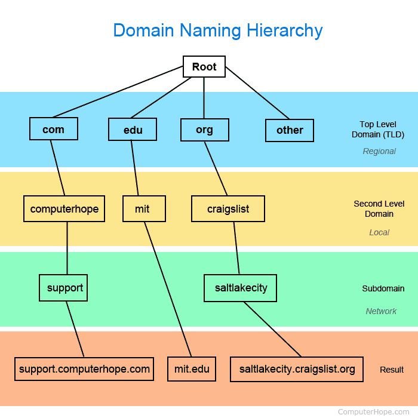
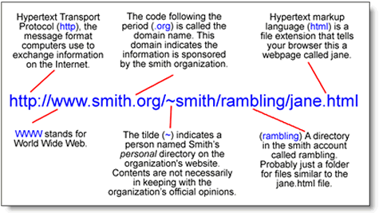

# The History of the Internet
The internet was invented as a way to solve a problem like some many other inventions. Vent Cerf and Bob Kahn were 
working on a project ARPANET, a Defense project that was made to create a way for communication after a nuclear attack. 
That experiment was the result of what we now know as the internet.

What is the Internet?

The internet is a collection of multiple different pieces of computer and non-computer equipment talking to one another 
by means of a communications network either wired or wireless.

The internet sends binary information. Information is made of **bits** or any pair of opposites. Today bits are sent by
 electricity, light, radio.  
-Using electricity bits are sent faster by **band width,**  the maximum transmission capacity of a device. Band with 
is measured by **bitrate** (the number of bits per second a system can transmit. Another measure of speed is 
**latency,** the amount of time it takes for a bit to travel from sender to receiver. 
-Using light is for sending bits very long distances. Using a fiber-optic cable, we can send bits as light beams 
- We send information wireless through the use of radio signal 

The internet is made up of independently operated networks, or networks of networks. Linking devices together around
 the world. WIFI connections devices to a ISP (internet service provider), and the ISP connects you to hundreds of 
 other networks.
 
 There are many protocols that are used on the Internet:
 - TCP and IP protocols
 - Routing protocols
 - Medium access control protocols
 - Application level protocols
 - and many more!
 
 **All devices on the internet have unique addresses**
 
 

 The IP address is the most important also know as the _Internet Protocol_
 When a person vis0ts a web page the computer is initially asking another computer for information. The IP address is
   used by the computer to know where to send the response.
   
   The IP Address has a hierarchy. The numbers are made up of an average of 32 bits.  The first set of number identify
   Country/Network -- Region/Network, then sub networks, and lastly the device. 
    
   **Domain Name System (DNS)**
   

   Originally created to be an open and public communications protocol for governments and educations organizations.
   
   Associates names with IP Addresses. Computers use DNS to look up domain names and retrieves the associated IP Address
   to your computer to your destination on the internet. Many computers connected to the Internet host part of the 
   DNS database and the software that allows others to access it (DNS servers). No DNS server contains the entire 
   database; they only contain a subset of it.
   
   ``If a DNS server does not contain the domain name requested by another computer, the DNS server re-directs the 
   requesting computer to another DNS server``
   
   DNS servers are connected in a hierarchy divided by zones where they have different roles. Such as .com, .org, .net,
    etc.
-	A top-level domain is the part of the domain that is located on the right of the dot “.” Common TLDs are .com, .net, and .org.
    
   **Routers – Special computers on the internet**
   
   

   Digital Information can be sent by IP Packets.

   If you are trying to send a larger item, that item can be made up of billions of bits. Larger items that are too 
   large to send in one packet are broken up into parts. These parts a packet with IP Address that tell where the packet 
   is coming from and where it is going to . 
   Keep IP Packets moving through networks smoothly.

   DNS servers are connected in a hierarchy divided by zones where they have different roles. Such as .com, .org, .net,
    etc.
    
   - A top-level domain is the part of the domain that is located on the right of the dot “.” Common TLDs are .com, 
   .net, and .org.
   
   Every router keeps track of multiple paths for sending packets, choosing the cheapest (meaning time, politics, and company relations) available path of each piece of data base on destination IP address.
   
   Having options for path makes the network fault tolerant, meaning it is apply to send packets even if something goes astray = relatability.  
  
   **TCP Transmission Control Protocol**
   Manages the sending and receiving of all data of packets.
   When applications open a connection to another computer on the Internet, the messages they send (using a specific 
   application layer protocol) get passed down the stack to the TCP layer. 
   
  ``Routers and TCP Systems are Scalable``
   
   **Communication**
   
   URL
   
   

   
   ###Universal
   
   ##Resource
   
   ##Locator
    
   When we look up or surf the internet your computer is talking to another computer (or server), asking the server for 
   a website. This “talking” is referred to ask HTTP. ``Hyper Text Transer Protocol.``
   The conversation between your computer and the server is made up of **Get Requests,** 
   which is GET the name of the document requested.
   
   - HTTP is a connectionless text based protocol.
   
   **HTML**
   
   Hyper Text Markup Langauge
   
   Is used to tell a web browser how to make a page look 
   
   When we send information, there is a HTTP Post Request, those requests go to servers.
   
   Cookies or ID Number, are what Webpages used to remember you, especially from post requests.
   
   **Security**
   SSL – Secure Socket Layer 
   TLS – Transport Layer Security
   
   SSL and TLS is use to protect people from hackers, snooping, and tampering
   
   HTTPS, makes sure that your HTTP request are secure and protected!
   
   When a servers ask browser to connect securely, it provides a digital certificate. These certificates are published by authorities – trusted entities that very identities of websites and issue certificates for them. 
   
   ####HTTP and DNS manage the sending and receiving of web files or anything on the web. 
   ####TCP/IP Address break down and transport information in small packet.
   -	Packets are made up of binary sequences of 1’s and 0’s and then are physically sent. 
  
   Private data can be kept secret through encryption – the scrambling or changing a message to hide the originally text. Decryption work in the opposite.
   -	Encryption is made of 256 bit 

