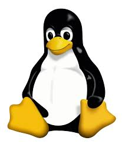

# Linux Tutorial
Linux, an open source O.S., was originally released on September 17th, 1991 and has been updated ever since then.
It was originally created as a personal project by Linus Torvalds, ever since creation, it’s been constantly updated. 
Torvalds never even intended for the program to reach the heights it did, stating “I'm doing a (free) operating system (just a hobby, won't be big and professional like gnu) for 386(486) AT clones”. 
The mascot for Linux, a well-known penguin, originally came from a zoo visit where Torvalds somehow managed to get himself bitten by one. 
