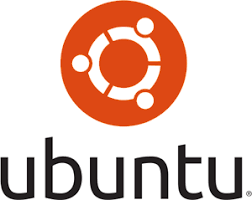

# A Brief History of Linux, Unix, and Ubuntu
- **LINUX**

Linux, an open source O.S., was originally released on September 17th, 1991 and has been updated ever since then.
It was originally created as a personal project by Linus Torvalds, ever since creation, it’s been constantly updated. 
Torvalds never even intended for the program to reach the heights it did, stating “I'm doing a (free) operating system (just a hobby, won't be big and professional like gnu) for 386(486) AT clones”. 
The mascot for Linux, a well-known penguin, originally came from a zoo visit where Torvalds somehow managed to get himself bitten by one. 

- **UNIX**

Unix,  a family of multitasking, multi user computer operating systems, was originally created around the mid-1960’s by Ken Thompson and Dennis Ritchie. 
The name “Unix” or “(Uniplexed Information and Computing Service” was actually a joke based off of on Multics (Multiplexed Information and Computer Services), 
another operation systems at the time that actually influenced the development for O.S. to come.

- **Ubuntu**

Ubuntu is built on Debian's architecture and infrastructure, and comprises Linux server, desktop and discontinued phone and tablet operating system versions.
Ubuntu releases updated versions predictably every six months, and each release receives free support for nine months (eighteen months prior to 13.04) with security fixes, high-impact bug fixes and conservative, 
substantially beneficial low-risk bug fixes. The first release was in October 2004
)

The following link leads you to a download for the ubuntu program

- [https://www.ubuntu.com/]

Linux Tutorial
==
- The first thing you should do when trying to operate linux, is make sure that you have your 
command line/terminal open.
- Once you have this opened up, you should input the command “pwd” which stands for “Print Working Directory”. This lets the user know immediately what directory they are currently working on.
- After figuring out the directory that you are in, inputting “ls”(List) will list the contents of the directory that you are in.
- Once you’ve seen everything listed in the directory, if there is a specific folder you want to get into, input “cd” followed by the name of the location to navigate into it 
- If you’ve entered the wrong folder or just simply want to leave the one you are in, input “cd ..” to back out.     
- “cd /” will take you to the root directory, which contains everything
- If a file within a folder is something that you want to copy and place somewhere else, input the command “cp”(which literally stands for copy) followed by the name of the file.   If you out another name following the files name, it will be renamed to that within the same folder
- If you want to remove a file, input “rm” into the command line followed by the name of the file
- To place a copied file into another folder, you input “cp” followed by /directory/user/destination you like for it to go ex: “cp file /home/asim/music”
- If you would want the copied file to paced in a whole new folder, use the command “mkdir”(Make directory) followed by the name you want  to create that file, if want to delete a folder, input “rmdir”(remove directory) followed by the name to remove it or -r and the folder name for if the folder is not empty. Ex: “rmdir -r folder”
- Inputting man(manual) followed by another command will give you details of the command.
- Finally, with all the commands you input, the screen will get cluttered, inputting clear will simply clear up the screen for you 
- If you ever need to change the permissions on files/folders, use the command "chmod"(change mode) followed by either "u", "g"
or "o"(User, group, Other), then either "+" or "-" (Adding/removing permission) and the name of file. Ex: "chmod u- music"
- To change ownership of a file, use the command "chown" followed by the same options stated above to change
ownership.

The following ling provides a visualization of the tutorial above:

- https://www.youtube.com/watch?v=IVquJh3DXUA

**FTP**
- FTP, or file File Transfer Protocol, is mainly used to transfer files from a client to a server within a computer network. 
FTP is usually shipped together with Linux and Unix.

**SFTP**
- SFTP , or SSH File Transfer Protocol, is a network protocol that provides file access, file transfer, and file management over any reliable data stream. 
This protocol assumes that it is run over a secure channel, such as SSH, that the server has already authenticated the client, and that the identity of the client user is available to the protocol.

**SSH**

- SSH is a cryptographic network protocol for operating network services securely over an unsecured network. 
SSH provides a secure channel over an unsecured network in a client–server architecture, connecting an SSH client application with an SSH server.
 
# Editing file with VI

- To initialize vi, input the command vi into the linux command line.
- Inputting “vi” followed by a name will create a new file with that name.
- Entering the command “i” in the command line put you in “insert mode”. This allows you to edit a file . Pressing the escape button takes you out of input mode.
- The command “w” writes/saves what you input in insert mode.
- To exit vi once you’re done, input “:q” to close out the editor 

The following link brings you to a youtube channel with more detail 
on editing with vi

- https://www.youtube.com/watch?v=SI8TeVMX8pk
 